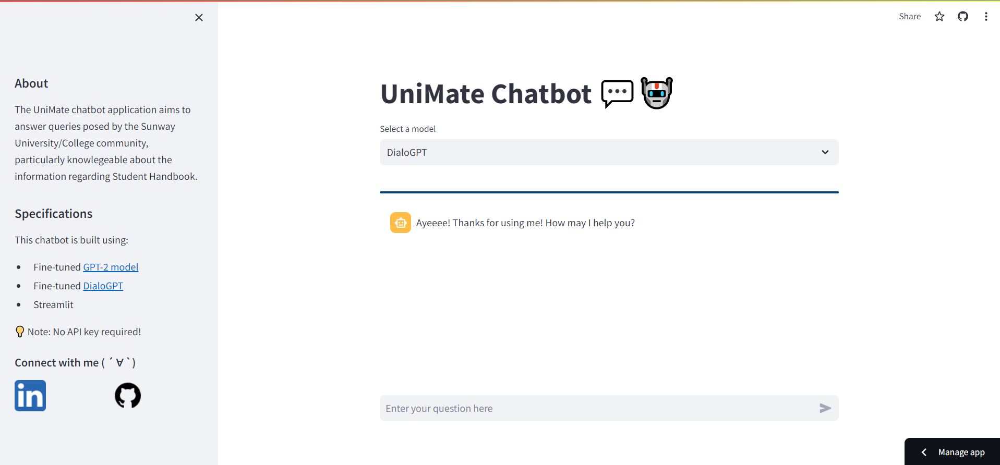

# 📦 UniMate Chatbot Application 

This chatbot aids the community of Sunway University / College in answering queries regarding the information stated in the Student Handbook. A user may choose either the fine-tuned GPT-2 model or DialoGPT model on the UniMate chatbot to accept his/her prompt and obtain a reponse generated by the chatbot. 

## Demo App
- To run locally :
    1. Download the repository.
    2. Open a command prompt and direct to the that repository by entering `cd [your directory]`.
    3. Run the python file by entering `python -m streamlit run streamlit_app.py`.
    4. Open up a browser to access the [localhost](http://localhost:8501/) at port 8501.
    5. Wait for the UniMate chatbot's dependencies to load properly. 
    6. Choose a model, then enter your prompt and observe the response generated. 

- To run remotely : 
    1. Head over to UniMate chatbot application on [Streamlit Cloud](https://unimate-chatbot.streamlit.app/).
    2. Wait for the UniMate chatbot's dependencies to load properly. 
    3. Choose a model, then enter your prompt and observe the response generated. 

## Screenshot of UniMate
